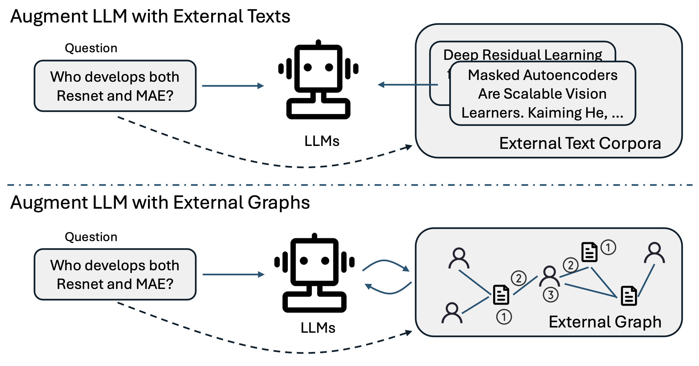
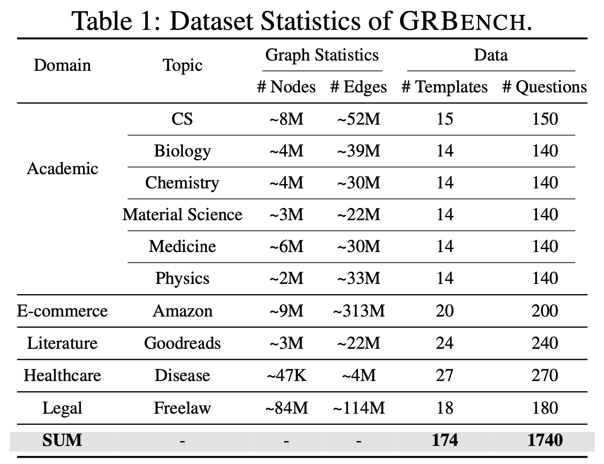

# Graph Chain-of-Thought
<!-- <center>  [[dataset](https://huggingface.co/datasets/PeterJinGo/GRBench)] 📖 [[arxiv](https://arxiv.org/pdf/2404.07103.pdf)] </center> -->
<div align="center">
   <a href="https://huggingface.co/datasets/PeterJinGo/GRBench">dataset</a> 📖 <a href="https://arxiv.org/pdf/2404.07103.pdf">arxiv</a>
</div>
&nbsp;

This repository contains the source code and datasets for [Graph Chain-of-Thought: Augmenting Large Language Models by Reasoning on Graphs](https://arxiv.org/pdf/2404.07103.pdf) accepted to ACL 2024.

## Links

- [Requirements](#requirements)
- [Motivation](#motivation)
- [Graph Reasoning Benchmark (GRBench)](#graph-reasoning-benchmark-grbench)
- [Graph CoT](#graph-cot)
- [Experiments](#experiments)
- [Citations](#citations)

## Requirements

The code is written in Python 3.8. Before running, you need to first install the required packages by typing following commands (Using a virtual environment is recommended):

```
conda create --name graphcot python==3.8
conda activate graphcot
conda install pytorch==1.12.1 torchvision==0.13.1 torchaudio==0.12.1 cudatoolkit=11.3 -c pytorch
conda install -c pytorch -c nvidia faiss-gpu=1.7.4
pip3 install -r requirements.txt
```

## Motivation
LLMs suffer from hallucination problems and sometimes tend to generate content that appears plausible but is ungrounded. To alleviate the hallucination issues, existing works propose to augment LLMs with external text corpora as knowledge sources and treat every **single document** as a knowledge unit. 

However, in real-world scenarios, text units are generally **interconnected**, forming a **(text-attributed) graph**. The knowledge of such graphs is reflected not only in the form of texts but also in the structure of their connections.

This motivates the research on how to augment LLMs with such structured knowledge sources.

<p align="center">
  
</p>


## Graph Reasoning Benchmark (GRBench)
GRBench is a comprehensive benchmark dataset to support the development of methodology and facilitate the evaluation of the proposed models for **Augmenting Large Language Models with External Textual Graphs**.

GRBench includes 10 real-world graphs that can serve as external knowledge sources for LLMs from five domains including *academic, e-commerce, literature, healthcare, and legal domains*. Each sample in GRBench consists of a manually designed question and an answer, which can be directly answered by referring to the graphs or retrieving the information from the graphs as context. To make the dataset comprehensive, we include samples of different difficulty levels: easy questions (which can be answered with single-hop reasoning on graphs), medium questions (which necessitate multi-hop reasoning on graphs), and hard questions (which call for inductive reasoning with information on graphs as context).

<p align="center">
  
</p>

You can directly download the graph environement files [here](https://drive.google.com/drive/folders/1DJIgRZ3G-TOf7h0-Xub5_sE4slBUEqy9?usp=share_link) and save them to `data/processed_data/{data_name}`.

You can access the question answering dataset for each domain [here](https://huggingface.co/datasets/PeterJinGo/GRBench). They can also be found in `data/processed_data/{data_name}/data.json`.

Detailed information of the raw data and how this benchmark is constructed can be found in [here](https://github.com/PeterGriffinJin/Graph-CoT/tree/main/data).

Notes: GRBench is also a potential benchmark for researchers to study LLMs as agents with graphs as environments.

## Graph CoT
We propose a simple and effective framework called Graph Chain-of-thought (Graph-CoT). The main idea is to enable LLMs to traverse the graph step-by-step to figure out the key information needed, rather than directly feeding the whole subgraph as context into the LLMs. 

Graph-CoT is an iterative framework, where one iteration corresponds to one step on the graph. Each iteration in Graph-CoT consists of three sub-steps: 

1) *Reasoning*: LLMs propose what conclusion we can make with the current information and what further information is needed from the graph; 
2) *Interaction*: LLMs generate the interactions needed to fetch information from the graph (e.g., finding the nodes, checking the neighbors, etc); 
3) *Execution*: The requests from the interaction step are executed on the graph and the corresponding information is returned.

In this way, LLMs can conduct chain-based reasoning on the graph and find the key information on the graph.
This process will be iterated until LLMs conclude the final answer in the reasoning sub-step.

<p align="center">
  
</p>


## Experiments

### Run Graph CoT

Graph CoT: ``Graph-CoT/``.

You can refer to the ``README.md`` inside each folder to know how to run the models. **Remember to change some of the bash variables first.**

### Run Baselines

Opensource LLMs (with its RAG version): ``LLM/``.

GPT models (with its RAG version): ``GPT/``.

You can refer to the ``README.md`` inside each folder to know how to run the models. **Remember to change some of the bash variables first.**

### Evaluation
Currently, we support both rule-based evaluation (e.g., EM, BLEU and ROUGE) and model-based evaluation (GPT4 as evaluator).

Remember to change all the ``DATASET`` to your dataset name and give your key to ``openai_key``.

```
bash eval.sh
```

## Citations

Please cite the following paper if you find the benchmark and code helpful for your research.
```
@article{jin2024graph,
  title={Graph Chain-of-Thought: Augmenting Large Language Models by Reasoning on Graphs},
  author={Jin, Bowen and Xie, Chulin and Zhang, Jiawei and Roy, Kashob Kumar and Zhang, Yu and Wang, Suhang and Meng, Yu and Han, Jiawei},
  journal={arXiv preprint arXiv:2404.07103},
  year={2024}
}
```

## Acknowledge
Some codes are adapted from [ToolQA](https://github.com/night-chen/ToolQA). Huge thanks to the contributors of the amazing repository!
