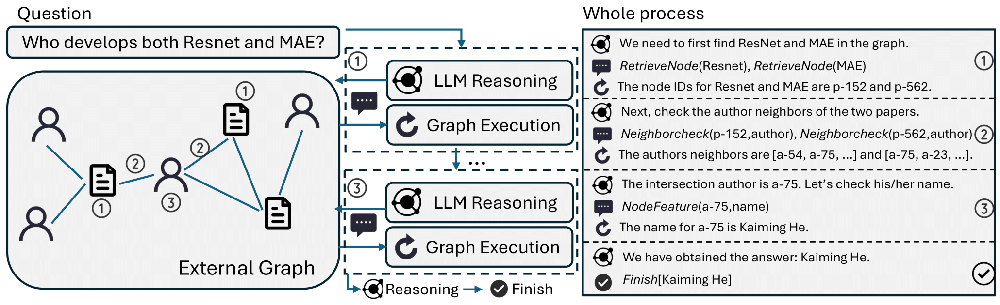

# Graph Chain-of-Thought

This repository contains the source code and datasets for [Graph Chain-of-Thought: Augmenting Large Language Models by Reasoning on Graphs]().

## Links

- [Requirements](#requirements)
- [Overview](#overview)
- [Edge Representation Learning](#edge-representation-learning-edgeformer-e)
- [Node Representation Learning](#node-representation-learning-edgeformer-n)
- [Citations](#citations)

## Requirements

The code is written in Python 3.8. Before running, you need to first install the required packages by typing following commands (Using a virtual environment is recommended):

```
pip3 install -r requirements.txt
```

## Motivation
LLMs suffer from hallucination problems and sometimes tend to generate content that appears plausible but is ungrounded. To alleviate the hallucination issues, existing works propose to augment LLMs with external text corpora as knowledge sources and treat every single document as a knowledge unit. 

However, in real-world scenarios, text units are generally interconnected, forming a (text-attributed) graph. The knowledge of such graphs is reflected not only in the form of texts but also in the structure of their connections.

This motivates the research on how to augment LLMs with such structured text corpora.


## Graph Reasoning Benchmark (GRBench)
GRBench is a comprehensive benchmark dataset to support the development of methodology and facilitate the evaluation of the proposed models for **Augmenting Large Language Models with External Textual Graphs**.

GRBENCH includes 10 real-world graphs that can serve as external knowledge sources for LLMs from five domains including academic, e-commerce, literature, healthcare, and legal domains. Each sample in GRBENCH consists of a manually designed question and an answer, which can be directly answered by referring to the graphs or retrieving the information from the graphs as context. To make the dataset comprehensive, we include samples of different difficulty levels: easy questions (which can be answered with single-hop reasoning on graphs), medium questions (which necessitate multi-hop reasoning on graphs), and hard questions (which call for inductive reasoning with information on graphs as context).


<p align="center">
  
</p>

You can directly download the processed graph [here](https://drive.google.com/drive/folders/1DJIgRZ3G-TOf7h0-Xub5_sE4slBUEqy9?usp=share_link) and save them to `data/processed_data/{data_name}`. The data for each domain can be found in `data/processed_data/{data_name}/data.json`.

Detailed information of the raw data and how this benchmark is constructed can be found in `data/raw_data/README.md`.

## Graph CoT
xxxx

<p align="center">
  
</p>


## Models & Evaluation

### Run the models
Opensource LLMs (with its RAG version): ``LLM/``.

GPT models (with its RAG version): ``GPT/``.

Graph CoT: ``Graph-CoT/``.

You can refer to the ``README.md`` inside each folder to know how to run the models. **Remember to change some of the bash variables first.**

### Evaluation
Currently, we support both rule-based evaluation (e.g., EM, BLEU and ROUGE) and model-based evaluation (GPT4 as evaluator).

Remeber to change all the ``DATASET`` to your dataset name.

```
bash eval.sh
```
